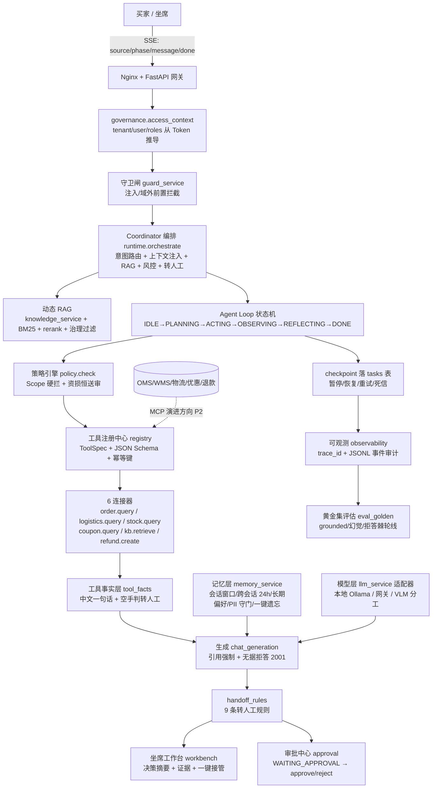
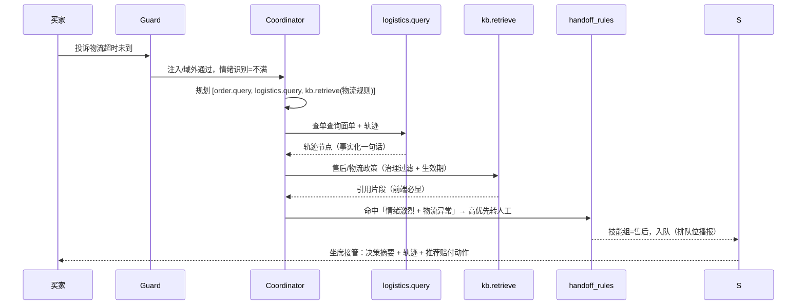

# 电商多 Agent 系统架构与落地需求（本平台特化版）

> 对齐文档：`多模态智能电商客服系统需求文档-FRDv2.md` §11（v2.4 起主机）+ §FR-3/FR-5/FR-7/FR-9/附录 A + `API接口与SSE事件协议规范.md` §5 + `RAG知识库构建检索治理规范.md` §1 + `执行步骤.md` §〇/一
> 版本：v0.2 | 日期：2026-09-18 | 状态：归档快照（内容已整体并入 `FRDv2.md §11`，本文档仅保留拆分版快照；后续以 FRDv2 §11 为准）
> 来源：以「电商多 Agent 系统架构与落地项目 Prompt」（五维硬性约束 + 四项交付物）为输入，逐条映射到本平台已落地代码与剩余缺口。
> 诚实性口径：`✅ 已落地` = 代码与测试均有（口径同 `执行步骤.md §一`）；`🔶 部分/演进中` 与 `⬜ 缺口` 如实标注。

---

## 1. 文档定位

本文是两个事实源的合流：

1. **通用 Prompt 五维硬性约束**：架构协作 / 记忆知识模型 / 工具工程基建 / 安全风控人机协同 / 评估验收。
2. **本平台现状**：单 Agent 内核（`backend/app/modules/agent/`）+ Coordinator 编排（`runtime.orchestrate`）+ 6 个业务连接器 + 守卫前置 + 审批恒送审 + 坐席工作台 + 全链路 trace + 黄金集评估。

目标读者：架构师（Tech Design Review Checklist）、产品/项目经理（PRD 与验收口径）、AI 辅助编码（脚手架生成边界）。

---

## 2. 五维硬性约束 × 本平台落地映射

### 2.1 架构与协作层

| # | 通用约束 | 本平台落地状态 | 代码/文档落点 |
|---|---|---|---|
| 1 | 全局调度 Coordinator（路由 + 电商上下文注入 + RAG + 风控 + 回置 + 人工转接） | ✅ 已落地：对话主链与任务链统一走编排，检索段回喂同一引用口径；风控前置守卫、无据拒答转人工、工具空手转人工 | `modules/agent/runtime.py::orchestrate/run/resume`；`services/chat_generation.py`；`services/guard_service.py` |
| 2 | 生产级 Agent Loop（超时、熔断、Checkpoint、单链路故障隔离） | ✅ 已落地：状态机 `IDLE→PLANNING→ACTING→OBSERVING→REFLECTING→DONE` + 三分支；每步 checkpoint 落 `tasks` 表；执行器 30s 超时、幂等重试 3 次、非幂等恒 1 次、连续失败熔断 60s；`resume` 续跑不重放 | `modules/agent/contracts.py`（TRANSITIONS）、`executor.py`、`runtime.py` |
| 3 | 权限隔离红线：Policy 不生成话术 / Response 不越权退款 / VLM 不触发退款；以规则与工具事实为准 | ✅ 已落地（内核级强制）：`policy.check` Scope 硬拦（无 scope → 4006）；`refund.create` 标 `requires_approval=True` **调用即进审批、账不动**（恒送审）；VLM 只输出结构化检测、无资损动作；工具结果经 `tool_facts` 中文事实化、只复述不编造 | `modules/agent/policy.py`、`connectors.py`（refund.create）、`tool_facts.py`、`services/vision_service.py` |

### 2.2 记忆、知识与模型层

| # | 通用约束 | 本平台落地状态 | 代码/文档落点 |
|---|---|---|---|
| 4 | 六层记忆 +「结构化业务事实层」（订单/物流/库存/客户授权） | ✅ 已落地（记忆五层 + 业务事实层）：会话窗口/预算摘要、跨会话 Redis 24h 滑动、长期偏好 PG 显式授权、PII 永不进记忆、一键遗忘；**业务事实不强存记忆**——订单/物流/库存实时走工具调用（`order.query/logistics.query/stock.query`），对齐「实时数据强依赖工具、严禁污染知识库」 | `services/memory_service.py`、`context_service.py`、`modules/agent/connectors.py`；数据模型 §4 |
| 5 | 动态 RAG（仅商品知识/尺码/售后启用；订单物流强依赖工具） | ✅ 已落地（RAG + 工具双通道）：商品知识自动同步（改价/改状态/改 SKU 同事务 upsert《商品知识｜…》）；知识带密级/生效期/渠道治理过滤、无据拒答 2001；订单/物流走工具不占引用编号 | `services/goods_service.py::sync_product_knowledge`、`knowledge_service.py`、`rag_governance.py`、`runtime.py`（tool_block 注入） |
| 6 | Skill 系统（SOP → Skill：退换货 / 物流异常 / 优惠争议 / 图片理解 / 升级人工） | 🔶 部分落地：转人工由规则表承载（9 条：喊人工/情绪激烈/敏感送审/图检低置信/无据拒答/编排空手/工具空手/连续未解决/连续降级），退换/物流/优惠/图片复核按场景路由；未落成独立「Skill 目录 + 发布/灰度」形态 | `services/handoff_rules.py`（9 规则表）、`handoff_service.py::auto_handoff` |
| 7 | 模型路由（小模型路由/分类、强模型回答、VLM 脏图片） | 🔶 部分落地：LLM 走适配层（本地 Ollama / 网关，失败降级绝不 500）；VLM 独立分工（脏图检测 → 结构化 → 低置信转人工）；「小模型先路由再升强模型」的网关路由位未接（预留位在） | `services/llm_service.py`、`vision_service.py`；FRD §2 模型网关行 |

### 2.3 工具与工程基建层

| # | 通用约束 | 本平台落地状态 | 代码/文档落点 |
|---|---|---|---|
| 8 | MCP 统一协议（封装 OMS/WMS/物流/优惠/退款，沿用审批/幂等策略） | 🔶 部分落地：内部等价物已有——注册中心（ToolSpec + JSON Schema 子集校验 + Scope + 幂等键 + 审批标记）+ 6 连接器薄适配，审批/幂等策略原生内置；**标准 MCP wire 协议为演进方向（P2）**，接口形态不变则连接器可平迁 | `modules/agent/registry.py`、`connectors.py`、`executor.py` |
| 9 | 异步任务（图片处理/文档入库/退款执行/通知/质检/人工回访剥离主链路；重试、限流） | ✅ 已落地（异步框架）：会话超 30s 自动转任务态 + `tasks` 表驱动（暂停/恢复/重试/死信）；文档入库异步 reindex、退款走审批、降级/转人工由规则表后置；图片收发已接 `media_store` | `services/task_service.py`、`document_lifecycle.py`、`approval_service.py`、`media_store.py` |
| 10 | 全链路 Trace/Replay（为什么答、查了什么、调什么工具、为何转人工/送审） | ✅ 已落地（Trace）+ 🔶 Replay：`trace_id` 贯穿 `done` 帧（references+guard+faithfulness）；`core/observability.record` 事件 JSONL（handoff/tool/rag/chat 全审计）；坐席工作台 Trace 三栏回看规划/检索/工具/Token；**独立回放播放器未建**（可由 tasks.checkpoint + 事件回放实现） | `core/observability.py`、API 规范 §5、`workbench_service.py`、`runtime.py` |

### 2.4 安全、风控与人机协同层

| # | 通用约束 | 本平台落地状态 | 代码/文档落点 |
|---|---|---|---|
| 11 | 风控前置（专项审核夸大承诺/错误退款/隐私泄露/越权订单访问/敏感赔付） | ✅ 已落地（守卫 + 策略双闸）：`guard_service` 注入/域外前置拦（问答第一道闸）；`policy` 资损/敏感动作恒审批；退款/补偿/改价全部 `WAITING_APPROVAL` 且批准才生效；订单工具强制校验归属（跨租户 404）；引用强制 + 拒答防幻觉赔付。**未设独立「放款/风控 Agent」，由守卫+策略+审批三组件合流承担** | `guard_service.py`、`policy.py`、`approval_service.py`、`connectors._order_query` |
| 12 | 人机无缝协同（坐席工作台：Agent 决策摘要 + 证据 + 推荐动作 + 一键接管） | ✅ 已落地：队列（技能组/排队位/负载均衡）、对话流（AI 接待 + 代回 + 一键接管）、右边栏（Trace/上下文用量）、内部备注、审批详情（政策引用 Top3）；`done.handoff` 恒带决策摘要 | `workbench_service.py`、`handoff_routing.py`、前端 `Workbench{Queue,Chat,Side,Notes}`；API 规范 §4.11 |

### 2.5 评估与验收层

| # | 通用约束 | 本平台落地状态 | 代码/文档落点 |
|---|---|---|---|
| 13 | Harness 验收门槛（风险/路由/Skill/RAG/API/队列全入 Harness，发布红线） | ✅ 已落地（工程级）：黄金集评估 `eval_golden.py`（grounded/幻觉/拒答棘轮线进 CI）；冒烟测试 `smoke_*.py` 逐域；全量 pytest（含 agent Runtime/守卫/审批/工作台专项）覆盖率 70% 阈值；`check_arch`/`check_design`/`check_version` 门禁；本地 husky + CI 双闸 | `scripts/eval_golden.py`、`backend/tests/`、`skills/anti-shit-code/scripts/check_arch.py`、`.github/workflows/ci.yml` |
| 14 | 多维业务指标（工具正确率/引用准确率/退款误触发率/人工接管率/自动解决率/P95/单会话成本） | 🔶 部分落地：可观测已出 `handoff` 接起率（avg/p95/达标率）+ 工具成功率 + 成本归因（token→分 + 人工对照 ¥15/通）；自动解决率/幻觉率有黄金集离线口径；**退款误触发率、在线自动解决率无持续跑测口径，P2 接实时事件聚合** | `core/observability.py::snapshot`、`services/costing.py`、`dashboard_service.py`、`studio_eval.py` |

---

## 3. 系统架构图（Mermaid）



---

## 4. 核心 Agent 角色定义与职责边界表

> 口径：本平台当前为**单 Agent 内核 + 角色化编排**。下表把通用 Prompt 的「角色」映射到内核组件与已有守卫，逐条给出 Prompt 定位 / 可调用工具 / 越权红线；红线由代码强制（`policy`/`guard`/恒送审），不依赖模型自觉。

| 角色（通用 Prompt） | 本平台落点 | Prompt 定位 | 可调用工具 | 越权红线（代码强制） |
|---|---|---|---|---|
| Coordinator（调度） | `runtime.orchestrate/run` + `handoff_rules` | 意图路由、电商上下文注入、检索/工具编排、回置、转人工挂起 | 全量编排位（本身不业务直调） | 不直改业务状态；无依据不硬答（2001）；空手必转人工 |
| Policy（策略/风控） | `policy.py` + `guard_service.py` | Scope 硬拦、注入/域外拦截、资损动作判送审 | 只读策略 `has_scope`；不执行业务 | **不生成客服话术**（专司判定，返回 allowed/approval_required/reason） |
| Response（回答） | `chat_generation.py` | 引用强制生成、中文话术、无据拒答 | `kb:read` 兜底 scope（检索引检索）+ 编排注入的业务事实块 | **不越权执行业务动作**（无资损工具挂载；生成结果不触发任何写入） |
| VLM（视觉） | `vision_service.py` | 图片瑕疵定级、结构化 `{category,confidence,bbox,desc}`、低置信转复核 | 读图（无业务工具） | **不直接触发退款**（仅输出检测，处置走审批/人工） |
| Refund/资损（敏感） | `connectors.refund.create`（`trade:refund` + `requires_approval=True`） | 发起退款申请 = 落售后单 + 审批单 | 仅退款创建 | **账不动**：批准前不执行 `apply_refund`；恒送审不走金额分支；资金动作非幂等恒 1 次 |
| 业务查询 | `connectors.{order,logistics,stock,coupon}.query` | 实时事实查询（订单/物流/库存/优惠） | 各自 scope（`order:read/stock:read/promo:read`） | 订单强校验归属（跨租户 404）；敏感字段脱敏展示；结果经 `tool_facts` 只复述不编造 |
| 转人工 | `handoff_rules.py` + `workbench_service` | 9 条规则命中挂起、技能组分配、队列排队位 | 读会话/队列；挂起状态机（none→pending） | 不抢已认领会话；坐席代回清零连续计数；命中多条取最高优先 |
| 记忆 | `memory_service.py` | 规则抽取八键（身高/体重/尺码…）、跨会话近况、长期偏好 | 读写 Redis/PG 记忆键 | PII 永不进记忆；长期写入仅显式授权；一键遗忘全清 |

---

## 5. 关键链路时序图

### 5.1 用户申请退款（恒送审 → 审批 → 生效）

```mermaid
sequenceDiagram
    participant U as 买家
    participant G as Guard 守卫
    participant C as Coordinator
    participant P as Policy
    participant R as refund.create
    participant A as 审批中心
    participant S as 坐席
    U->>G: 上传瑕疵图 + 描述
    G->>G: 注入/域外检查通过
    G->>C: 意图=售后/退款，进入编排
    C->>C: 规划步骤 [kb.retrieve(退换政策), stock.query, refund.create]
    C->>R: refund.create(order_id, amount, reason)
    R->>P: policy.check(roles, spec, args)
    P->>R: allowed=true; approval_required=true（恒送审）
    R->>A: 落售后单 + 审批单（WAITING_APPROVAL，账不动）
    A-->>U: done 帧：tool_calls=[refund.create(待审批)] + handoff 摘要
    S->>A: POST /approvals/{id}/approve（证据核验）
    A->>A: apply_refund 生效，记录不可篡改
    A-->>U: 审批通过通知（附单号/金额）
```

### 5.2 物流异常投诉（意图识别 → 工具 → 转人工/赔付）



---

## 6. 项目里程碑与风险评估

> 阶段划分解法复刻通用 Prompt 的四期，但每期结论以本平台 `执行步骤.md` 实际迭代为准。

| 阶段 | 本平台位置 | 状态 | 本阶段交付物 | 主要风险与对策 |
|---|---|---|---|---|
| 基建期（工具/内核/RAG 地基） | v0.1.x–v0.2.6：Agent Runtime、注册中心、政策、执行器、双路 RAG | ✅ 已完成 | `modules/agent/` 七件套；黄金集 200 条；Alembic squash 基线 | 风险：工具 Schema 漂移 → 注册中心自检 + 测试锁 Spec；RAG 幻觉 → 守卫 + 引用强制 + 拒答棘轮线 |
| 单 Agent 跑通期（一条主链走通） | v0.2.3–v0.3.5：SSE 流式、编排接主链、工作台/转人工/审批闭环 | ✅ 已完成 | `/chat` 真流式；`done` 工具卡；工作台一键接管；审批恒送审；自动解决率首个真模型数 | 风险：编排双回退不干净 → `AGENT_CHAT_ORCHESTRATE` 回滚开关 + degraded 审计；转人工误派 → 9 规则表 + 技能组加载 |
| 多 Agent 协同期（角色化 + 异步 + 全链路） | v0.3.6–当前 + P2 | 🔶 演进中 | 角色化边界表（§4）；异步任务框架；全链路 trace；成本归因 | 风险：角色越权 → 政策引擎 Scope 硬拦 + 恒送审（不依赖模型自觉）；异步链路无回看 → tasks.checkpoint + 事件回放（P2 补齐 Replay） |
| Harness 验收期（风险/路由/Skill/RAG/API/队列全入 Harness） | 已进 CI，P2 扩业务指标 | ✅ 门槛已建 + 🔶 指标补位 | 黄金集棘轮线进 CI；冒烟逐域；覆盖率 70% 阈值；`check_design` 棘轮 18/18 | 风险：指标无持续口径 → 退款误触发率/在线自动解决率接实时事件聚合（P2）；Harness 只测工程不测业务 → 按 §2.5 表逐条验收 |

### 6.1 主要技术风险汇总

| 风险 | 影响面 | 现有对策 | 剩余动作 |
|---|---|---|---|
| 模型幻觉越权（退款/赔付误触发） | 资损 + 合规 | 恒送审 + Scope 硬拦 + 引用强制 + 拒答 2001 | 接退款误触发率实时口径（P2） |
| 知识库污染（订单/物流实时数据误入 RAG） | 回答准确率 | 动态 RAG：业务事实走工具、商品知识走检索，双通道隔离 | 检索测试截图沉淀（RAG 规范） |
| 转人工误派/漏派 | 人工成本 + 体验 | 9 条规则表 + 技能组负载均衡 | 规则命中统计报表（P2） |
| 异步任务失败无回看 | 工单丢失 | tasks 表驱动（暂停/恢复/重试/死信） | 事件回放播放器（P2） |
| 模型/外部服务不可用 | 可用性 | 适配层降级、摘要/演示流兜底、绝不 500 | 维持降级口径 |

---

## 7. 与本平台文档/代码的对照（验收时按此核对）

| 通用 Prompt 交付物 | 本文档章节 | 对应代码/测试 |
|---|---|---|
| 架构图 | §3 | `backend/app/modules/agent/`、`services/{chat_generation,guard_service,memory_service,vision_service,llm_service}.py` |
| Agent 角色与职责边界表 | §4 | `modules/agent/{policy,connectors,registry,tool_facts}.py` + `services/handoff_rules.py` |
| 关键链路时序图 | §5 | `backend/tests/`（agent Runtime / 守卫 / 审批专项）+ `smoke_*.py` |
| 里程碑与风险评估 | §6 | `执行步骤.md` §剩余工序（A–F） |
| 五维约束清单 | §2 | `API接口与SSE事件协议规范.md`、`RAG知识库构建检索治理规范.md`、`测试评估验收方案.md` |

---
