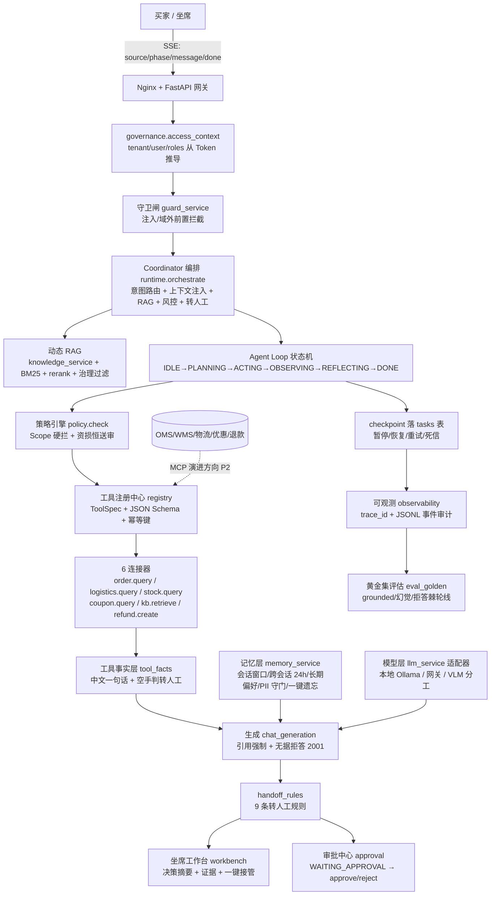
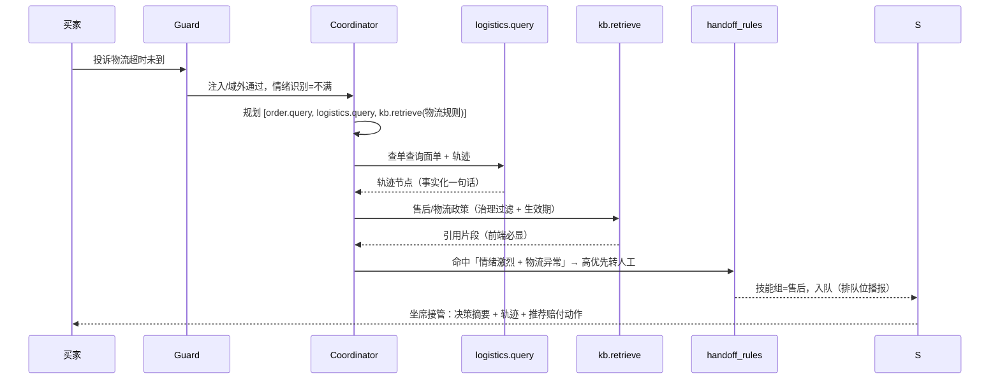

# 企业级大模型驱动电商服装多模态智能客服系统 功能需求文档 FRD v2

> 版本：v2.4 | 日期：2026-09-18 | 状态：基线
> 合并来源：多模态智能电商客服系统需求文档.md / 电商开发文档.md / 前端工程化.md / 后端工程化.md / 部署工程化.md / 多Agent系统架构与落地需求.md
> 变更：v2.1 新增 FR-10 B端商家后台（商品/进销存/履约/对账）+ FR-11 数据可视化大屏与经营闭环；v2.2 补 FR-10.6-10.8（营销会员/物流/评价）+ FR-12 横向支撑（风控/消息/工单/组织绩效/多平台/大促），闭环无断点；v2.3 新增 FR-13 企业知识库模块 + `docs/knowledge-base/` 29 篇种子文档（RAG 可直接导入）；v2.4 新增 §11 多Agent系统架构与落地需求（五维硬性约束 × 平台落地映射 14 条 + 架构图 + 角色职责边界表 + 关键链路时序图 + 里程碑与风险），合并自 `多Agent系统架构与落地需求.md`（该拆分文档保留，AGENTS.md §1 索引不变）。
> 定位：立项 / 招投标 / 研发 / 测试验收统一依据。

一句话定义：**多模态交互（文本/图片/语音）+ Agent Runtime 状态机 + 场景化 RAG 与业务连接器 + 人机协同审批与坐席工作台 + 多租户与模型网关 + 全链路可观测与评估 + K8s 云原生交付 + 成本与 ROI 闭环 = 生产可用、可治理、可评估、成本可控的智能客服平台。**

---

## 1. 文档概述

### 1.1 项目背景
电商服装（淘宝 / 抖店 / 拼多多 / 京东 / 独立站）日均咨询 800-1200 条，高峰 5-10 倍。痛点：人工成本高、响应慢、尺码 / 面料 / 优惠 / 物流 / 退换高频重复；售后需传瑕疵图、发语音，传统文本机器人无法闭环；大模型直答幻觉率高，不可直接生产。

### 1.2 产品目标
1. 降本增效：自动解决率 ≥80%，单会话成本 ≤ 人工 1/10。
2. 多模态闭环：文本流式 + 图片瑕疵检测 + 语音转写合成，置信度兜底。
3. 业务精准：RAG 强约束 + 引用必现 + 无据拒答，幻觉率 ≤2%。
4. 生产可控：多租户隔离、人机协同、审批 100%、全链路审计、成本归因、灰度回滚、大促可用。

### 1.3 范围
In：C 端咨询、图文售后、语音客服、订单/物流/库存/优惠/会员/退款工具、审批转人工、坐席工作台、运营后台、网关/可观测/评估、K8s 交付。
Out（v1 不做，预留接口）：实时电话外呼、视频客服、跨境多语言（仅预留 locale + 模型路由位）。

### 1.4 目标用户
买家 / 人工客服 / 运营 / 平台管理员 / 平台 SRE / 安全合规。

---

## 2. 术语与技术选型基线（统一五篇冲突点）

| 维度 | 开发默认 | 生产标准 | 说明 |
|---|---|---|---|
| 对话 LLM | Qwen2.5-7B-Instruct | 模型网关路由：小模型优先，复杂上大模型；支持硅基流动 / OpenAI / 通义 / 私有 vLLM | 按租户配额 + 成本策略路由，Fallback 链必填 |
| 视觉 VLM | Qwen3-VL-8B-Instruct | 同左，GPU 节点池常驻 + 预热 | 挂了降级为人工复核，不硬失败 |
| 语音 | SenseVoiceSmall ASR + edge-tts 晓晓 | 网关封装，可切音色 | 方言/低置信转文字兜底 |
| RAG 向量 | ChromaDB + BGE-small-zh（CPU） | pgvector 起步，>100 万向量切 Milvus / Qdrant | 统一 `RagService` 接口，底层可换 |
| 业务 DB | SQLite 兼容 | PostgreSQL 主从 + Alembic 版本迁移 | 生产强制 PG |
| 缓存/队列 | Redis 单机 | Redis Cluster/Sentinel + Celery/ARQ + Redis Streams / RabbitMQ | Worker 用 KEDA 按队列长度伸缩 |
| 对象存储 | MinIO | S3 / OSS / MinIO（统一 S3 协议） | 存瑕疵图 / 语音，人脸打码后存 |
| 前端 | Vue3 + TS strict + Element Plus + Pinia + Vite + pnpm | 同左 + CDN + Nginx | 按业务域分层，统一 SSE 事件协议（权威源：API 规范 §5） |
| 后端 | FastAPI + Pydantic v2 + SQLAlchemy 2.0 async | + Gunicorn/Uvicorn + K8s HPA | Router 薄 / Service 厚 / Runtime 专 |
| 可观测 | OTel + Prometheus + Grafana + Loki/ELK + Sentry + Langfuse | 同左 | 日志字段强制 trace/tenant/user |

工程原则：API 薄、Service 厚、Runtime 专、工具可插拔、RAG/记忆/网关独立；一切皆代码、不可变镜像、无状态优先、控制面/数据面分离、默认安全、可回滚。

---

## 3. 角色与权限矩阵 RBAC/ABAC

| 角色 | 核心权限 | 数据范围 |
|---|---|---|
| 买家 | 发起会话、传图、发语音、看回复 | 仅 `user_id` 本人会话 |
| 人工客服 | 接管/抢接/转接、快捷回复、内部备注、审批敏感操作、改参重试、看完整 Trace | 所属 `tenant_id` + 技能组（售前/售后/VIP） |
| 运营 | 知识 CRUD/版本/检索测试、Prompt 版本灰度、评估集、敏感词/极限词库、大促话术开关 | 所属租户知识库与配置 |
| 管理员 | 租户/订阅/配额/网关/计费/SLO/审计 | 全局，操作留痕 |
| 商家管理员/店长 | 商品上下架、采购审批、调拨/报损审批、看全店经营大屏 | 所属店铺（tenant 下店铺维度） |
| 仓管 | 入库/出库/盘点/调拨执行、库存预警处理 | 所属仓库 |
| 财务 | 对账单查看/导出、日结确认 | 所属店铺资金视图（无 PII） |
| SRE/安全 | 发布/回滚/告警/密钥/网络策略 | 基础设施面 |

强制（与代码 skills 对齐，安全红线）：
- 绝不信任请求体里的 `tenant_id/user_id` 做权限判断，可见范围一律 `governance.access_context()`（从 Token 的 ContextVar 推导）；service 层用 `current_user()` 取人；记忆/检索读写键必须是 `(tenant, Token用户名, thread)` 同一口径。
- RAG 检索带 `tenant_id + security_level + 生效期 + 渠道` 过滤。
- 工具按 Scope 鉴权 `order:read / trade:refund / kb:write` 等；敏感端点 `Depends(require_perm(...))`。
- 前端按钮级 `v-permission` + 路由 `meta.roles` + 后端 `Depends(get_current_user)` 双检；401（含业务码 1002）走中央 `handle401()`。
- 统一信封 `ok(data,msg)/fail(ErrorCode,中文msg,http)`，错误码 1xxx通用/2xxx对话（含2001拒答/2002限流）/3xxx业务/4xxx任务/5xxx系统；`trace_id` 框架自动带。
- 详见 `API接口与SSE事件协议规范.md`、`数据模型与存储设计.md`、`RAG知识库构建检索治理规范.md`、`测试评估验收方案.md`。

---

## 4. 功能需求

### FR-1 多模态智能交互

**FR-1.1 文本客服**
- 多轮对话，意图识别：咨询 / 导购 / 投诉 / 售后；情绪识别：正常 / 不满 / 愤怒。
- RAG 检索后生成，System Prompt 强制“仅基于引用回答”。
- SSE 流式，统一事件协议（前后端契约，**唯一权威源：《API接口与SSE事件协议规范.md》§5**，此处仅为摘要，不得偏离）：
  事件名固定 `source / phase(retrieving[/inspecting]/generating/validating) / message / done`（任务类另有 `progress/complete/error`；图文轮多一帧 `inspecting`）；`done` 载荷必含 `references + guard + faithfulness + trace_id`（另有 `session_id/tool_calls[]/orchestration/handoff/context` 等加法字段，老前端忽略即可）。前端按 `event: / data:` 正则分帧解析，`done` 的 `JSON.parse` 必须 try/catch，请求必带 `Authorization: Bearer <reai_token>`。注意与旧设计差异：**工具调用不是独立事件类型**（经 `done.tool_calls[]` 透出），**审批不是事件**（走 `WAITING_APPROVAL` 状态机 + `/approvals` 接口，FR-7），错误不单独占事件（信封 `fail` + 错误码号段 §2）。
- 断线重连 + 事件 ID 幂等，前端增量渲染 + 虚拟列表（长会话），乐观更新；新会话本地先建 `t-${Date.now()}`，成功后以后端为准；后端不可用回退 `@/mock` 演示，模型不可用走演示降级绝不 500。

**FR-1.2 图文客服（VLM 瑕疵检测）**
- 限制：≤9 张 / 单张 ≤10M / JPG-PNG-WEBP；超限前端压缩 + 后端拒收码 `2004 IMAGE_TOO_LARGE`（号段口径见 API 规范 §2）。
- 预处理：BGR→RGB，Base64/S3 URL 双入参；必经 NSFW / 黄赌毒 / 人脸检测，人脸打码后存。
- VLM 输出结构化：`{category: 污渍/破洞/脱线/色差/开线/尺寸不符/吊牌异常/无瑕疵, confidence:0-1, bbox?, desc}`。
- 置信度 `<0.6` 或 `无瑕疵但用户坚持` → 自动转人工复核，不硬答。
- 检测结果拼入 LLM 上下文 + RAG 退换政策，生成 `致歉 + 定级 + 方案{退/换/补/修} + 时效`。
- 前端：图片预览 / 缩放 / 标注（可选）/ 检测卡片 + CitationList。
- 预留：OCR（吊牌/面单）、以图搜款找同款。

**FR-1.3 语音客服（ASR/TTS）**
- ≤60s / ≤5M，Mp3/Wav/M4A/Opus；ASR 返回 `text + confidence`，低置信回问确认。
- 回复支持 TTS，可开关、可切音色（默认晓晓），前端波形 + 播放 + 文字对照。
- 录音/转写需明示并获同意；方言/噪音不支持时降级文字并告知。

**FR-1.4 会话管理**
- `session_id` 隔离，PG 持久化 + Redis 短期上下文。
- 双重修剪：轮数 N（默认 20）+ Token 预算 M（默认 8k），超限摘要压缩 + 正则清洗。
- 支持恢复、翻页、按单号关联多会话。

### FR-2 服装业务场景（v1 与 v2 差异最大处）

**售前导购**
- 尺码推荐必填：身高 / 体重 / 三围（可选）/ 版型偏好（修身/常规/宽松）/ 面料弹力；缺参追问，给范围不给绝对值，不确定时给 `M-L 均可，建议 M` + 要更多数据。
- 面料解答、洗护、库存查询、优惠叠加规则引擎（满减/券/预售尾款），大促话术版本一键切换。

**售中**
- 订单查询、物流追踪（节点卡片）、改地址、催发货；调用业务连接器，敏感字段脱敏显示 `138****1234`。

**售后**
- 退换政策咨询、图文瑕疵定级、投诉。7 天无理由 / 质量问题 15 天等按知识生效期判断，过期知识不可召回。
- 主动营销禁令：仅用户触发可推优惠，不主动骚扰。

闭环：发起 → 意图+情绪路由 → RAG+工具 → 回复/转人工 → 持久化 → mining 进运营后台。

### FR-3 Agent Runtime 状态机
`IDLE → PLANNING → ACTING → OBSERVING → REFLECTING → DONE`，分支 `WAITING_APPROVAL / WAITING_HUMAN / FAILED`。
- 检查点每步持久化 `tasks` 表，支持暂停/恢复/重试/超时 + 死信队列。
- 每步 TraceID，工具必经策略引擎 `policy.check`。
- 长任务转异步 + 轮询 / WebSocket，不阻塞 SSE（>30s 自动转异步）。

### FR-4 RAG 知识库与记忆
- 知识格式 JSON：`{title, content, tenant_id, 适用渠道, 生效起止, 版本}`，按业务主题切分，非固定段长。
- 混合检索：向量 + BM25 + rerank，TopK=5，`tenant_id + 生效期` 过滤，热点缓存。
- 无依据拒答话术：“这个问题我暂时没查到权威政策，已为你转人工…”，禁编造单号/政策。
- 前端必显引用来源，可点跳原文。
- 更新走异步 reindex，版本可回滚，运营可检索测试预览。
- 记忆：短期 Redis TTL 24h；长期偏好 PG/向量，需授权，可一键遗忘（GDPR/个保）。

### FR-5 工具调用系统（清单见附录 A）
- 注册中心：JSON Schema + Scope + 幂等键 + 超时 30s 重试 3 次 + 熔断 + 沙箱 + 全审计。
- 三级容错：重试 → 降级预设话术“系统繁忙，已记录，转人工跟进” → 网关熔断切规则机器人。
- 工具调用前端以 ToolCallCard 透明展示，可展开参果。

### FR-6 模型网关与成本
- 统一入口：路由 / Fallback / 缓存 / 限流 / 配额 / Token+GPU 成本归因（按租户/部门/Agent）。
- 小模型优先，复杂升级；Key 集中 Vault / K8s Secret / External Secrets，不进代码/镜像/前端。
- 超预算自动限流或降级 + 告警。

### FR-7 人机协同、审批与坐席工作台

**触发转人工：** 用户喊人工 / 连续 3 次不懂 / 愤怒 / VLM 低置信 / 敏感退款 / 模型连续失败 / 无据拒答。
**坐席工作台（v1 必须有最小闭环）：**
- 待接队列 + 技能组 + 负载均衡 + VIP 优先 + 排队位播报。
- 完整 Trace：规划 / 检索引用 / 工具参果 / Token 耗。
- 快捷回复、内部备注（买家不可见）、抢接/转接、质检打分、绩效统计。
**审批：**
- 退款/补偿/改价进 `WAITING_APPROVAL`，`POST /approvals/{id}/approve|reject`，可改参重试。
- 超时升级、批量审批、移动审批（预留），记录不可篡改、可审计回溯。

### FR-8 运营与管理后台
- 租户与订阅计费：按会话 / 按 Token / 包年，试用 / 欠费停服 / 超额限流。
- Prompt 版本管理 + 灰度 + 回滚；评估集管理；敏感词 + 广告极限词（最/第一/顶级）动态库。
- 大促开关、公告、OpenAPI/Webhook、企微/钉钉告警。
- 前端模块：ChatView / TaskCenter / ApprovalCenter / AgentStudio（Prompt/工具/知识画布）/ AdminPanel（租户/配额/审计）。

### FR-9 可观测与评估
- 日志结构化 JSON：`timestamp/level/service/trace_id/request_id/tenant_id/user_id`，进 Loki/ELK；审计日志单独不可篡改存。
- 指标 Prometheus+Grafana：QPS、首字延迟 P50/P95、错误率、自动解决率、幻觉率、工具成功率、Token/成本、任务完成率、队列长、GPU 利用。
- 追踪 OTel + Langfuse/LangSmith：规划/检索/模型/工具每步。
- 前端 Sentry + Web Vitals LCP/FID/CLS + 埋点。
- 评估：黄金集 ≥500 条（售前 200/售中 100/售后 200 含图文 100），LLM-as-judge + 人工抽检双轨；影子流量 / A-B；不达标禁发布。

### FR-10 B端商家后台（商品/进销存/履约/对账，与 C 端客服同 tenant 打通）

**FR-10.1 商品管理**
- SPU/SKU 模型：SPU（款）→ SKU（颜色×尺码矩阵，服装必需），条码、吊牌价/售价/券后价、主图/详情/面料成分。
- 上下架、价格改价（进审批，防资损）、库存同步显示；商品变更自动同步客服知识（面料/尺码/价格段），避免答旧价。
- Scope：`goods:read/write`，角色店长以上可改价，客服只读。

**FR-10.2 库存管理**
- 多仓库存，可用库存 = 在库 − 预占（已下单未发货）− 锁定（售后质检中）；超卖率必须为 0，靠下单预占 + 并发扣减（Redis 原子）。
- 出入库流水：采购入 / 销售出 / 售后退货入 / 盘点盈亏 / 调拨 / 报损，全量留痕可追溯。
- 安全库存预警：低于阈值钉钉/企微告警 + 客服话术自动切“补货中，预计 X 天”（读采购到货 ETA）。
- 盘点：PDA/Excel 导入盘点任务，差异进审批。

**FR-10.3 采购进货**
- 供应商档案（资质/账期/合格率）；采购单：草稿 → 审批 → 到货 → 质检 → 入库 → 对账，退供逆向同链。
- 采购价写入成本，质检不合格触发客服拦截（暂停该批次销售并公告）。

**FR-10.4 订单履约与售后**
- 订单本地镜像（平台 API 同步：淘宝/抖店/拼多多/京东），打单发货、物流单回传，状态机：待付→待发→已发→签收→完成/售后。
- 售后单关联客服会话 `trace_id`：退货质检 → 二次入库 / 报损 / 退供，退款走既有审批流（`WAITING_APPROVAL`）。
- 客服 `stock.query/order.query` 读的是同一套库存/订单源，杜绝两张皮。

**FR-10.5 资金对账（轻量）**
- 应收/实收/退款/运费/平台扣点日结单，差异超阈值告警；对账单导出，财务确认留痕。

**FR-10.6 营销与会员（客服可执行，资损红线）**
- 优惠券/满减/赠品活动管理（预算、总量、限领、生效期），发券必须幂等 + 预算原子扣减，超预算返回 `3006`。
- 会员等级/积分/储值（服装复购关键），客服会话内可发券安抚（敏感阈值以上进审批），核销全链路对账。
- 直播/拼团/分销员（P2）：口令/短链归因到客服或分销员，结算防刷。
- Scope：`promo:write`，活动创建店长以上，客服仅按话术模板发券。

**FR-10.7 物流管理**
- 快递公司/运费模板/首重续重（按地区/重量，服装轻抛件注意体积重），面单打印、揽收、异常件（滞留/破损/拒收）自动建售后单。
- 发货承诺受库存 ETA 约束；物流异常主动触达买家（消息中心），拦截客服重复承诺。

**FR-10.8 评价管理（口碑闭环）**
- 中差评实时监控 + 2 小时响应 SLA，自动邀评（签收后 N 天，好评返现合规话术禁诱导好评违反平台规则部分需人工审）。
- 差评一键建工单（→ 质检/仓库/客服），处理结果回访；评价打标反哺知识库与选品（面料/尺码类 Top 原因自动聚类）。

统一约束：所有单据幂等键 + 敏感动作（采购/调拨/报损/超阈值退款）进审批 + 审计；查询强制 `tenant_id`，仓管再按仓库过滤。

### FR-11 数据可视化大屏与经营闭环

**FR-11.1 经营大屏（投屏模式，PII 全脱敏）**
- 销售：GMV/订单量/访客/转化率/客单价（今日 vs 昨日/上周，5 分钟级准实时）。
- 客服：接待量/自动解决率/转人工率/满意度/首响 P95。
- 售后：退货率、Top 退货原因、瑕疵 Top 类别（联动 VLM 检测分布）。
- 库存：周转天数、缺货 SKU、滞销 SKU、安全库存预警数。
- 数据源：订单/会话/`tool_calls`/`cost_records`/库存流水 → 日快照宽表，Redis 缓存 1 分钟，大屏 30 秒轮询（WebSocket 预留）。

**FR-11.2 经营闭环（数据回流到客服）**
- 大屏发现异常（如某款退货率突增）→ 一键下钻到相关会话/质检记录 → 运营补知识 → 客服话术更新 → 黄金集回归，与 FR-4 mining 闭环衔接。
- 补货预测 P2：按销量+季节+大促日历给采购建议数（规则版先行，LLM 版后续）。

### FR-12 横向支撑域（跨模块不断环）

**FR-12.1 风控合规**
- 羊毛党/刷单/恶意退款识别（设备/地址/账号关联图谱，规则版先行），命中拦截返回 `3007` 并转人工复核，禁全自动封号。
- 黑名单/灰名单分级管控，操作留痕可申诉；大促限购（ID 限购/地址限购）与库存锁定联动。

**FR-12.2 消息触达中心**
- 站内信/短信/企微/平台消息统一模板 + 频次管控（防骚扰：营销类 1 条/人/天），发货/签收/退款/差评回访自动触发。
- 发送记录可查，失败重试 + 到达率统计进大屏。

**FR-12.3 跨部门工单**
- 客服→仓库→财务→质检协同工单（售后核查/补发/价格异常），SLA 分级 + 超时升级 + 全程留痕，关闭需回填结论（沉淀知识）。
- 评价/风控/盘点差异均可一键建工单，工单状态反写源单。

**FR-12.4 组织与绩效**
- 客服排班/技能组/绩效（解决率/满意度/响应/质检分），工资提成导出；店长看板到人，PII 脱敏。
- 权限随岗位自动回收（离职一键冻结，审计可查）。

**FR-12.5 多平台店铺集成**
- 淘宝/抖店/拼多多/京东/独立站授权管理，订单/商品/库存/售后统一映射到本地模型，平台差异（退款时效/运费规则）走渠道配置。
- 平台 API 限流排队 + 失败重试 + 对账（平台账 vs 本地账）。

**FR-12.6 大促保障**
- 活动报名/价格力校验（防先涨后降）、预售尾款链路、库存预留池、大促话术/知识版本一键切换与回滚。
- 熔断降级预案：模型/支付/物流任一异常→规则话术 + 排队 + 公告，全链路演练每季度一次。

### FR-13 企业知识库模块（客服回答的唯一权威来源，与 FR-4 RAG 链路同源）

**FR-13.1 内容模型与元数据**
- 单篇口径即 `kb_docs` 行：`{title, content, tenant_id, channels, security_level, valid_from/to, version}`，按业务主题切分，不按固定段长（对齐 RAG 规范 §1）。
- 种子首批 29 篇落 `docs/knowledge-base/`（Markdown front-matter 即元数据，导入时替换 `tenant` 为目标租户编码）：尺码导购 5 / 面料洗护 4 / 优惠会员 4 / 订单物流 5 / 退换售后 5 / 评价发票客服 3 / 风控安全 1 / B端协同 2（`internal`）。
- 正文三段式：政策口径（编号条款）/ 客服话术要点 / 转人工边界；禁编造单号、政策与时效。

**FR-13.2 生命周期**
- 草稿 → 审核（运营双人复核，资损相关条款必审）→ 发布（版本号 +1）→ 归档；回滚即切回上一版本，`valid_to` 过期自动不可见。
- 大促话术靠版本切换与回滚（不覆盖旧版），切换 <5min（对齐 FR-12.6）。

**FR-13.3 权限与隔离**
- 租户隔离：检索强制 `tenant_id` 过滤，跨租户 0 召回；`security_level` 三级（公开/内部/机密），`confidential` 需 `kb:write` 级权限，会话侧默认只召回 `public`。
- B端协同类（发货包装/质检标准）标 `internal`，仅坐席工作台可见，买家端不可召回。

**FR-13.4 检索与问答约束**
- 混合检索 TopK=5，同 doc 至多 2 chunk；回答必须带引用角标可点跳原文；无据走 2001 拒答话术 + 转人工（对齐 RAG 规范 §3-§4）。
- 置信度/分数低于 `THRESHOLD`（`Settings` 热更）不得硬答。

**FR-13.5 运营闭环**
- 检索测试：运营输入 query 预览召回分数与过滤原因；命中为 0 的高频问自动进 mining 待补知识。
- 工单/差评关闭回填结论沉淀为知识候选；黄金集回归不达标禁发布。
- 统计：按主题看引用命中率，被引用为 0 超 30 天的文档提示复核或归档。

**FR-13.6 验收**
- 29 篇全量导入无重复（SHA256 去重）；跨租户串数 0；过期文档不可召回；拒答话术与转人工链路可用。

---

## 5. 非功能需求 NFR

**性能与 SLO：** 流式首字 <2s（P95），完整 <10s；坐席消息 <1s；1000 并发混合（文 70%/图 20%/音 10%）通过；SSE 关闭缓冲 `proxy_buffering off`，`proxy_read_timeout 3600s`，多副本粘性会话或共享状态。
**可用与灾备：** 日常 99.9%，大促 99.95%，多可用区 + PDB + 优雅停机；DB 每日全量 + WAL，Redis 持久化 + 哨兵/集群，对象存储跨区复制；模型多副本，公有云 Fallback；RTO<15min RPO<5min，定期故障演练。
**安全合规：** 等保 / PIPL / GDPR / 电商法留痕 ≥6 个月；PII 脱敏，不存明文手机地址；Prompt 注入/越狱/图片对抗过滤；WAF + 限流防重放防刷；镜像 Trivy/Grype 扫描 + Cosign 签名 + SBOM；K8s RBAC 最小 + NetworkPolicy 默认拒绝 + Falco/Tetragon 运行时；密钥 Vault/External Secrets。
**工程化：** 后端 Ruff + mypy + pytest + coverage 门禁；前端 ESLint + Prettier + Stylelint + Husky + commitlint + vue-tsc；CI `lint→typecheck→test→build→镜像扫描→SBOM`，不通过不合并；GitOps ArgoCD，滚动/蓝绿/金丝雀/功能开关/影子，DB 迁移先加字段后发代码再删旧字段，向前兼容可回滚。
**成本：** requests/limits 必填，HPA/KEDA 按 CPU/QPS/队列伸缩，GPU 节点池按需启停 + 预热，检索/模型双缓存，月度 ROI 报表 + 预算告警。

---

## 6. 核心业务流程

**P1 图文售后（主流程）：**
1. 买家传图 + “衣服这里破了，怎么处理？”
2. 前端打包 → 网关鉴权 → 对象存储 → NSFW/PII 预检。
3. VLM 检测 `袖口脱线约2cm 0.82`。
4. 拼接检测 + RAG 检索退换政策 TopK。
5. LLM 生成致歉 + 方案 + 引用 → SSE 流式 → 追问是否代申请退货。
6. 确认 → 退款工具 → WAITING_APPROVAL → 坐席批 → 执行 → 审计 → 归档 → mining。
**P2 转人工：** 3 次不懂/愤怒 → WAITING_HUMAN → 坐席看 Trace 接管 → 内部备注 + 质检。
**P3 B端经营闭环（进销存→客服→大屏→复盘）：**
1. 仓管建采购单 → 店长审批 → 到货质检 → 入库（库存+，成本写入）→ 商品上架。
2. 买家咨询尺码/库存 → 客服读同一库存源承诺交期 → 下单预占（防超卖）→ 打单发货 → 物流回传。
3. 签收后瑕疵售后 → 售后单关联会话 trace → 质检 → 二次入库/报损/退供 → 退款审批。
4. 日结对账 → 大屏复盘（GMV/解决率/退货率/周转）→ 异常下钻补知识 → 话术更新回归。
**P4 增长与口碑环：** 营销发券（预算扣减）→ 下单核销 → 对账 → 会员积分 → 复购；差评 → 2h 响应 → 工单（质检/仓库）→ 回访 → 打标反哺选品/知识；风控拦截 → 人工复核 → 黑名单/放行；大促 → 预留池/话术切换 → 战报复盘。

---

## 7. 验收标准（可测口径）

| 项 | 阈值 | 测法 |
|---|---|---|
| 三模态闭环 | 文/图/音全通 | E2E Playwright + MSW mock SSE |
| 自动解决率 | ≥80% | 黄金集 + 线上抽 1000 条人工标，口径：一次解决无需转人工 |
| RAG grounded / 幻觉 | ≥95% / ≤2% | judge + 人工，引用可点溯 |
| 瑕疵分类 F1 / 召回 | ≥0.85 / ≥0.9 | 200 张/类测试集 |
| 敏感操作审批率 | 100% | 审计扫漏 + 渗透越权测 |
| 首字 P95 / 可用 / 转人工接起 | <2s / 99.9% / ≥95% 30s 内 | 压测 + APM |
| 并发 | 1000 混合 | k6/Locust，Ingress 已关缓冲 |
| CI/回滚/灰度 | 全过，一键回滚 <5min | 演示 |
| 成本归因误差 | <5%，单会话 ≤人工 1/10 | 账单对账 |
| 库存账实一致 / 超卖 | 一致率 ≥99.5%，超卖率 =0 | 盘点 + 并发下单压测（预占校验） |
| 采购/调拨/报损审批 | 100% 进审批 | 审计扫漏 |
| 大屏时效 / 对账差异 | 准实时 <5min，对账差异 <0.1% | 快照任务监控 + 日结对账 |
| 营销资损 / 核销对账 | 预算超发 =0，发券核销对平 | 幂等 + 原子扣减压测 + 对账 |
| 差评响应 / 风控误伤 | 差评 2h 响应率 ≥95%，风控人工复核率 100%（禁全自动封号） | 工单 SLA 报表 + 拦截抽检 |
| 消息到达 / 大促切换 | 触达到达率 ≥98%（频控下），大促话术一键切换 <5min | 通道报表 + 切换演练 |

---

## 8. 分期路线

**P0 MVP 4-6 周：** 文本 + 单图售后 + ASR/TTS 基线 + RAG + 退款审批 + 转人工最小台 + 多租户 + 网关 + SSE + PG/Redis/MinIO + K8s + 可观测 + 黄金集 200 条 + CI 门禁。
**P1 2-4 周：** 以图搜款/OCR/坐席完整台/计费/混合检索 rerank/大促预案/A-B/影子 + B端一期（商品/SKU/库存/订单履约/经营小屏 + 营销发券/评价/工单）。
**P2 持续：** 多语言/视频/挖掘闭环/微前端拆分 Chat/Studio/Admin/等保认证/灾备演练常态化 + B端二期（采购审批/对账/大屏投屏/补货预测 + 风控/绩效/多平台/大促保障）。

---

## 9. 交付物
前端源码（对话/审批/任务/Studio/Admin + B端商品/库存/采购/订单/财务/大屏）/ 后端（Runtime/RAG/网关/工具/记忆/审批/评估 + B端进销存服务）/ K8s YAML + Dockerfile + Nginx + ArgoCD / API Swagger + 事件协议 doc / 部署运维手册 / pytest+vitest+E2E + 黄金集 + 压测报告 / SBOM + 扫描报告 / 企业知识库种子文档（`docs/knowledge-base/` 29 篇，RAG 可直接导入）。

## 10. Top 风险
供应商挂 → Fallback + 规则机器人；幻觉赔付 → 引用强制 + 拒答；图片误判 → 阈值 + 人工复核；大促击穿 → 限流 + 预热 + 降级；跨租户串数 → 三重校验 + 渗透测；密钥泄漏 → Vault + 轮换。

---

## 11. 多 Agent 系统架构与落地需求（合并自《多Agent系统架构与落地需求.md》）

> 本章是把「电商多 Agent 系统架构与落地」通用约束（架构协作 / 记忆知识模型 / 工具工程基建 / 安全风控人机协同 / 评估验收 五维）逐条落到本平台的映射文档，与 FR-3/FR-4/FR-5/FR-7/FR-9/FR-13 及附录 A 同源互补：功能需求正文定"要什么"，本章定"系统如何组织、角色边界如何隔离、链路如何流转、分期如何推进"。
> 诚实性口径：`✅ 已落地` = 代码与测试均有（口径同 `执行步骤.md §一`）；`🔶 部分/演进中` 与 `⬜ 缺口` 如实标注。

### 11.1 五维硬性约束 × 本平台落地映射

**架构与协作层**

| # | 通用约束 | 本平台落地状态 | 代码/文档落点 |
|---|---|---|---|
| 1 | 全局调度 Coordinator（路由 + 电商上下文注入 + RAG + 风控 + 回置 + 人工转接） | ✅ 已落地：对话主链与任务链统一走编排，检索段回喂同一引用口径；风控前置守卫、无据拒答转人工、工具空手转人工 | `modules/agent/runtime.py::orchestrate/run/resume`；`services/chat_generation.py`；`services/guard_service.py` |
| 2 | 生产级 Agent Loop（超时、熔断、Checkpoint、单链路故障隔离） | ✅ 已落地：状态机 `IDLE→PLANNING→ACTING→OBSERVING→REFLECTING→DONE` + 三分支；每步 checkpoint 落 `tasks` 表；执行器 30s 超时、幂等重试 3 次、非幂等恒 1 次、连续失败熔断 60s；`resume` 续跑不重放 | `modules/agent/contracts.py`（TRANSITIONS）、`executor.py`、`runtime.py` |
| 3 | 权限隔离红线：Policy 不生成话术 / Response 不越权退款 / VLM 不触发退款；以规则与工具事实为准 | ✅ 已落地（内核级强制）：`policy.check` Scope 硬拦（无 scope → 4006）；`refund.create` 标 `requires_approval=True` **调用即进审批、账不动**（恒送审）；VLM 只输出结构化检测、无资损动作；工具结果经 `tool_facts` 中文事实化、只复述不编造 | `modules/agent/policy.py`、`connectors.py`（refund.create）、`tool_facts.py`、`services/vision_service.py` |

**记忆、知识与模型层**

| # | 通用约束 | 本平台落地状态 | 代码/文档落点 |
|---|---|---|---|
| 4 | 六层记忆 +「结构化业务事实层」（订单/物流/库存/客户授权） | ✅ 已落地（记忆五层 + 业务事实层）：会话窗口/预算摘要、跨会话 Redis 24h 滑动、长期偏好 PG 显式授权、PII 永不进记忆、一键遗忘；**业务事实不强存记忆**——订单/物流/库存实时走工具调用（`order.query/logistics.query/stock.query`），对齐「实时数据强依赖工具、严禁污染知识库」 | `services/memory_service.py`、`context_service.py`、`modules/agent/connectors.py`；数据模型 §4 |
| 5 | 动态 RAG（仅商品知识/尺码/售后启用；订单物流强依赖工具） | ✅ 已落地（RAG + 工具双通道）：商品知识自动同步（改价/改状态/改 SKU 同事务 upsert《商品知识｜…》）；知识带密级/生效期/渠道治理过滤、无据拒答 2001；订单/物流走工具不占引用编号 | `services/goods_service.py::sync_product_knowledge`、`knowledge_service.py`、`rag_governance.py`、`runtime.py`（tool_block 注入） |
| 6 | Skill 系统（SOP → Skill：退换货 / 物流异常 / 优惠争议 / 图片理解 / 升级人工） | 🔶 部分落地：转人工由规则表承载（9 条：喊人工/情绪激烈/敏感送审/图检低置信/无据拒答/编排空手/工具空手/连续未解决/连续降级），退换/物流/优惠/图片复核按场景路由；未落成独立「Skill 目录 + 发布/灰度」形态 | `services/handoff_rules.py`（9 规则表）、`handoff_service.py::auto_handoff` |
| 7 | 模型路由（小模型路由/分类、强模型回答、VLM 脏图片） | 🔶 部分落地：LLM 走适配层（本地 Ollama / 网关，失败降级绝不 500）；VLM 独立分工（脏图检测 → 结构化 → 低置信转人工）；「小模型先路由再升强模型」的网关路由位未接（预留位在） | `services/llm_service.py`、`vision_service.py`；FRD §2 模型网关行 |

**工具与工程基建层**

| # | 通用约束 | 本平台落地状态 | 代码/文档落点 |
|---|---|---|---|
| 8 | MCP 统一协议（封装 OMS/WMS/物流/优惠/退款，沿用审批/幂等策略） | 🔶 部分落地：内部等价物已有——注册中心（ToolSpec + JSON Schema 子集校验 + Scope + 幂等键 + 审批标记）+ 6 连接器薄适配，审批/幂等策略原生内置；**标准 MCP wire 协议为演进方向（P2）**，接口形态不变则连接器可平迁 | `modules/agent/registry.py`、`connectors.py`、`executor.py` |
| 9 | 异步任务（图片处理/文档入库/退款执行/通知/质检/人工回访剥离主链路；重试、限流） | ✅ 已落地（异步框架）：会话超 30s 自动转任务态 + `tasks` 表驱动（暂停/恢复/重试/死信）；文档入库异步 reindex、退款走审批、降级/转人工由规则表后置；图片收发已接 `media_store` | `services/task_service.py`、`document_lifecycle.py`、`approval_service.py`、`media_store.py` |
| 10 | 全链路 Trace/Replay（为什么答、查了什么、调什么工具、为何转人工/送审） | ✅ 已落地（Trace）+ 🔶 Replay：`trace_id` 贯穿 `done` 帧（references+guard+faithfulness）；`core/observability.record` 事件 JSONL（handoff/tool/rag/chat 全审计）；坐席工作台 Trace 三栏回看规划/检索/工具/Token；**独立回放播放器未建**（可由 tasks.checkpoint + 事件回放实现） | `core/observability.py`、API 规范 §5、`workbench_service.py`、`runtime.py` |

**安全、风控与人机协同层**

| # | 通用约束 | 本平台落地状态 | 代码/文档落点 |
|---|---|---|---|
| 11 | 风控前置（专项审核夸大承诺/错误退款/隐私泄露/越权订单访问/敏感赔付） | ✅ 已落地（守卫 + 策略双闸）：`guard_service` 注入/域外前置拦（问答第一道闸）；`policy` 资损/敏感动作恒审批；退款/补偿/改价全部 `WAITING_APPROVAL` 且批准才生效；订单工具强制校验归属（跨租户 404）；引用强制 + 拒答防幻觉赔付。**未设独立「放款/风控 Agent」，由守卫+策略+审批三组件合流承担** | `guard_service.py`、`policy.py`、`approval_service.py`、`connectors._order_query` |
| 12 | 人机无缝协同（坐席工作台：Agent 决策摘要 + 证据 + 推荐动作 + 一键接管） | ✅ 已落地：队列（技能组/排队位/负载均衡）、对话流（AI 接待 + 代回 + 一键接管）、右边栏（Trace/上下文用量）、内部备注、审批详情（政策引用 Top3）；`done.handoff` 恒带决策摘要 | `workbench_service.py`、`handoff_routing.py`、前端 `Workbench{Queue,Chat,Side,Notes}`；API 规范 §4.11 |

**评估与验收层**

| # | 通用约束 | 本平台落地状态 | 代码/文档落点 |
|---|---|---|---|
| 13 | Harness 验收门槛（风险/路由/Skill/RAG/API/队列全入 Harness，发布红线） | ✅ 已落地（工程级）：黄金集评估 `eval_golden.py`（grounded/幻觉/拒答棘轮线进 CI）；冒烟测试 `smoke_*.py` 逐域；全量 pytest（含 agent Runtime/守卫/审批/工作台专项）覆盖率 70% 阈值；`check_arch`/`check_design`/`check_version` 门禁；本地 husky + CI 双闸 | `scripts/eval_golden.py`、`backend/tests/`、`skills/anti-shit-code/scripts/check_arch.py`、`.github/workflows/ci.yml` |
| 14 | 多维业务指标（工具正确率/引用准确率/退款误触发率/人工接管率/自动解决率/P95/单会话成本） | 🔶 部分落地：可观测已出 `handoff` 接起率（avg/p95/达标率）+ 工具成功率 + 成本归因（token→分 + 人工对照 ¥15/通）；自动解决率/幻觉率有黄金集离线口径；**退款误触发率、在线自动解决率无持续跑测口径，P2 接实时事件聚合** | `core/observability.py::snapshot`、`services/costing.py`、`dashboard_service.py`、`studio_eval.py` |

### 11.2 系统架构图（Mermaid）



### 11.3 核心 Agent 角色定义与职责边界表

> 本平台当前为**单 Agent 内核 + 角色化编排**。下表把通用 Prompt 的「角色」映射到内核组件与已有守卫；红线由代码强制（`policy`/`guard`/恒送审），不依赖模型自觉。

| 角色（通用 Prompt） | 本平台落点 | Prompt 定位 | 可调用工具 | 越权红线（代码强制） |
|---|---|---|---|---|
| Coordinator（调度） | `runtime.orchestrate/run` + `handoff_rules` | 意图路由、电商上下文注入、检索/工具编排、回置、转人工挂起 | 全量编排位（本身不业务直调） | 不直改业务状态；无依据不硬答（2001）；空手必转人工 |
| Policy（策略/风控） | `policy.py` + `guard_service.py` | Scope 硬拦、注入/域外拦截、资损动作判送审 | 只读策略 `has_scope`；不执行业务 | **不生成客服话术**（专司判定，返回 allowed/approval_required/reason） |
| Response（回答） | `chat_generation.py` | 引用强制生成、中文话术、无据拒答 | `kb:read` 兜底 scope（检索引检索）+ 编排注入的业务事实块 | **不越权执行业务动作**（无资损工具挂载；生成结果不触发任何写入） |
| VLM（视觉） | `vision_service.py` | 图片瑕疵定级、结构化 `{category,confidence,bbox,desc}`、低置信转复核 | 读图（无业务工具） | **不直接触发退款**（仅输出检测，处置走审批/人工） |
| Refund/资损（敏感） | `connectors.refund.create`（`trade:refund` + `requires_approval=True`） | 发起退款申请 = 落售后单 + 审批单 | 仅退款创建 | **账不动**：批准前不执行 `apply_refund`；恒送审不走金额分支；资金动作非幂等恒 1 次 |
| 业务查询 | `connectors.{order,logistics,stock,coupon}.query` | 实时事实查询（订单/物流/库存/优惠） | 各自 scope（`order:read/stock:read/promo:read`） | 订单强校验归属（跨租户 404）；敏感字段脱敏展示；结果经 `tool_facts` 只复述不编造 |
| 转人工 | `handoff_rules.py` + `workbench_service` | 9 条规则命中挂起、技能组分配、队列排队位 | 读会话/队列；挂起状态机（none→pending） | 不抢已认领会话；坐席代回清零连续计数；命中多条取最高优先 |
| 记忆 | `memory_service.py` | 规则抽取八键（身高/体重/尺码…）、跨会话近况、长期偏好 | 读写 Redis/PG 记忆键 | PII 永不进记忆；长期写入仅显式授权；一键遗忘全清 |

### 11.4 关键链路时序图

**用户申请退款（恒送审 → 审批 → 生效）**

```mermaid
sequenceDiagram
    participant U as 买家
    participant G as Guard 守卫
    participant C as Coordinator
    participant P as Policy
    participant R as refund.create
    participant A as 审批中心
    participant S as 坐席
    U->>G: 上传瑕疵图 + 描述
    G->>G: 注入/域外检查通过
    G->>C: 意图=售后/退款，进入编排
    C->>C: 规划步骤 [kb.retrieve(退换政策), stock.query, refund.create]
    C->>R: refund.create(order_id, amount, reason)
    R->>P: policy.check(roles, spec, args)
    P->>R: allowed=true; approval_required=true（恒送审）
    R->>A: 落售后单 + 审批单（WAITING_APPROVAL，账不动）
    A-->>U: done 帧：tool_calls=[refund.create(待审批)] + handoff 摘要
    S->>A: POST /approvals/{id}/approve（证据核验）
    A->>A: apply_refund 生效，记录不可篡改
    A-->>U: 审批通过通知（附单号/金额）
```

**物流异常投诉（意图识别 → 工具 → 转人工/赔付）**



### 11.5 项目里程碑与风险评估

| 阶段 | 本平台位置 | 状态 | 本阶段交付物 | 主要风险与对策 |
|---|---|---|---|---|
| 基建期（工具/内核/RAG 地基） | v0.1.x–v0.2.6 | ✅ 已完成 | `modules/agent/` 七件套；黄金集 200 条；Alembic squash 基线 | 工具 Schema 漂移 → 注册中心自检；RAG 幻觉 → 守卫 + 引用强制 + 拒答棘轮线 |
| 单 Agent 跑通期（一条主链走通） | v0.2.3–v0.3.5 | ✅ 已完成 | `/chat` 真流式；`done` 工具卡；工作台一键接管；审批恒送审；自动解决率首个真模型数 | 编排双回退不干净 → `AGENT_CHAT_ORCHESTRATE` 回滚开关 + degraded 审计；转人工误派 → 9 规则表 + 技能组加载 |
| 多 Agent 协同期（角色化 + 异步 + 全链路） | v0.3.6–当前 + P2 | 🔶 演进中 | 角色化边界表（§11.3）；异步任务框架；全链路 trace；成本归因 | 角色越权 → 政策引擎 Scope 硬拦 + 恒送审（不依赖模型自觉）；异步链路无回看 → tasks.checkpoint + 事件回放（P2） |
| Harness 验收期（风险/路由/Skill/RAG/API/队列全入 Harness） | 已进 CI，P2 扩业务指标 | ✅ 门槛已建 + 🔶 指标补位 | 黄金集棘轮线进 CI；冒烟逐域；覆盖率 70% 阈值；`check_design` 棘轮 18/18 | 指标无持续口径 → 退款误触发率/在线自动解决率接实时事件聚合（P2）；Harness 只测工程不测业务 → 按 §7 验收标准逐条验收 |

**主要技术风险汇总**

| 风险 | 影响面 | 现有对策 | 剩余动作 |
|---|---|---|---|
| 模型幻觉越权（退款/赔付误触发） | 资损 + 合规 | 恒送审 + Scope 硬拦 + 引用强制 + 拒答 2001 | 接退款误触发率实时口径（P2） |
| 知识库污染（订单/物流实时数据误入 RAG） | 回答准确率 | 动态 RAG：业务事实走工具、商品知识走检索，双通道隔离 | 检索测试截图沉淀（RAG 规范） |
| 转人工误派/漏派 | 人工成本 + 体验 | 9 条规则表 + 技能组负载均衡 | 规则命中统计报表（P2） |
| 异步任务失败无回看 | 工单丢失 | tasks 表驱动（暂停/恢复/重试/死信） | 事件回放播放器（P2） |
| 模型/外部服务不可用 | 可用性 | 适配层降级、摘要/演示流兜底、绝不 500 | 维持降级口径 |

### 11.6 与既有 FR 的衔接（避免重复实现）

| 本章约束点 | 已覆盖的 FR/附录 | 衔接说明 |
|---|---|---|
| 注册中心 / 审批 / 幂等 / Scope 鉴权 | §3 角色权限矩阵 + 附录 A 业务连接器 + FR-5 工具调用 | 多Agent 约束 #8 的"注册中心"落地于此；FR-5 定义了 JSON Schema + Scope + 幂等键 + 超时重试 + 熔断全链路 |
| Agent 状态机 / Checkpoint / 隔离 | FR-3 Agent Runtime 状态机 | 多Agent 约束 #2 的"生产级 Loop"落地于此；FR-3 定义了状态转移分支 + tasks 持久化 + 长任务转异步 |
| RAG 双通道 / 记忆 / Skill 化 | FR-4 RAG 知识库 + FR-13 企业知识库 | 多Agent 约束 #4-6 的"业务事实走工具、商品知识走检索、SOP 转 Skill"落地于此 |
| 审批 / 转人工 / 工作台 | FR-7 人机协同、审批与坐席工作台 | 多Agent 约束 #11-12 的"守卫+策略双闸 + 一键接管"落地于此；FR-7 定义了完整队列/Trace/审批流 |
| 可观测 / 指标 / Harness | FR-9 可观测与评估 + §7 验收标准 + §8 分期路线 | 多Agent 约束 #10/13/14 的"Trace+JSONL+黄金集+指标"落地于此；退款误触发率/在线自动解决率 P2 补位 |
| 标准 MCP wire 协议 / Replay 播放器 / 模型路由网关 | FR-5（预留位）+ §8 分期路线 P2 | 多Agent 约束 #7-8-10 的 P2 缺口对齐此处分期；连接器接口形态不变，P2 只迁协议栈 |
| 角色边界表（§11.3） | FR-3 + FR-7 + FR-9 | 本表是 FR 定义的角色在系统层的细化映射；验收时按本表逐角色审查工具清单与权限边界 |

---

## 附录 A：业务连接器 API 契约（v1 必实现 7 个）

通用：鉴权 `Bearer JWT(tenant/user/roles)`；幂等头 `Idempotency-Key`；超时 30s 重试 3 次（仅幂等安全方法自动重试）；错误码：**数字号段制（1xxx~5xxx），唯一权威源《API接口与SSE事件协议规范.md》§2（`core/exceptions.py::ErrorCode`，新增必须落号段）**；下述旧英文枚举（OK/PARAM_INVALID/AUTH_DENIED/TENANT_ISOLATION/QUOTA_EXCEEDED/TOOL_TIMEOUT/UPSTREAM_FAILED/APPROVAL_REQUIRED/IMAGE_TOO_LARGE/UNSAFE_CONTENT/NOT_FOUND）已废弃，语义对照以 §2 错误码表为准（例：超限 `2004 IMAGE_TOO_LARGE`、送审 `4003 APPROVAL_REQUIRED`）。

| 工具 | Scope | 入参 | 出参 | 备注 |
|---|---|---|---|---|
| order.query | order:read | `{order_id, user_id}` | `{status, items[{sku,size,qty,price}], total, address_masked, tenant_id}` | 必校验订单归属 |
| logistics.query | order:read | `{order_id}` | `{nodes[{time, desc}], eta}` | 节点卡片渲染 |
| stock.query | stock:read | `{sku, size}` | `{available, eta_restock}` | 大促缓存 30s |
| coupon.query | promo:read | `{user_id}` | `{coupons[], rules}` | 叠加规则由引擎算 |
| refund.create | trade:refund | `{order_id, reason, amount, evidence_urls[]}` | `{refund_id, status:WAITING_APPROVAL}` | 恒进审批，不直执 |
| image.inspect | vision:inspect | `{image_urls[], session_id}` | `{category, confidence, bbox?, desc, safe_pass}` | <0.6 转人工 |
| kb.retrieve | kb:read | `{query, top_k=5}` | `{docs[{title, snippet, source, score}], trace}` | 带 tenant+生效期过滤 |

审批：`POST /approvals/{id}/approve {modified_args?}` / `.../reject {reason}`，鉴权 `approval:write` + 同租户 + 技能组。

流式：`POST /api/v1/agent/chat/stream` SSE `text/event-stream`，事件见 FR-1.1；长任务 >30s 返回 `{task_id}` 转 `GET /tasks/{id}` 轮询 / WS。

---

## 附录 B：核心建表（PostgreSQL，最小闭环）

```sql
create table tenants(id uuid primary key, name text not null, plan text default 'trial', quota_tokens bigint default 1000000, created_at timestamptz default now());
create table users(id uuid primary key, tenant_id uuid references tenants(id), external_id text, role text, created_at timestamptz default now());
create table sessions(id uuid primary key, tenant_id uuid not null, user_id uuid not null, channel text, status text default 'active', created_at timestamptz default now());
create table messages(id uuid primary key, session_id uuid not null, role text, modality text, content text, attachments jsonb default '[]', citations jsonb default '[]', trace_id text, created_at timestamptz default now());
create index on messages(session_id, created_at);
create table tasks(id uuid primary key, tenant_id uuid not null, user_id uuid not null, agent_id text, status text, input jsonb, output jsonb, error jsonb, checkpoint jsonb, created_at timestamptz default now(), updated_at timestamptz default now());
create table approvals(id uuid primary key, tenant_id uuid not null, session_id uuid, action text, args jsonb, status text default 'pending', approver uuid, reason text, created_at timestamptz default now(), decided_at timestamptz);
create table tool_calls(id uuid primary key, trace_id text, tenant_id uuid, user_id uuid, name text, args jsonb, result jsonb, latency_ms int, created_at timestamptz default now());
create table kb_docs(id uuid primary key, tenant_id uuid not null, title text, content text, channels text[] default '{all}', valid_from timestamptz, valid_to timestamptz, version int default 1, created_at timestamptz default now());
create table audit_logs(id uuid primary key, tenant_id uuid, actor uuid, action text, target text, detail jsonb, created_at timestamptz default now());
create table cost_records(id uuid primary key, tenant_id uuid, session_id uuid, model text, prompt_tokens int, completion_tokens int, cost_cents int, created_at timestamptz default now());
-- 所有业务查询强制 where tenant_id = :tid；订单类再 join 校验归属；审计表只追加不改。
```

---

## 附录 C：验收 Checklist（发布门禁）
- [ ] 三模态 E2E 通，弱网/断线重连过
- [ ] 黄金集 ≥500，解决率/幻觉/引用达标
- [ ] 瑕疵集 F1/召回达标，低置信转人工演示
- [ ] 退款 100% 进审批，越权测 0 泄漏，极限词/PII 过滤过
- [ ] 1000 混合压测 + 首字 P95 + 熔断降级演示
- [ ] CI 全绿 + SBOM + 扫描 + ArgoCD 灰度回滚 <5min
- [ ] 成本归因对账误差 <5%，SLO 大盘 + 告警 + 留痕 ≥6 个月可查
- [ ] B端：超卖率 0（并发下单压测）+ 账实一致 ≥99.5% + 采购/调拨/报损 100% 审批 + 大屏 <5min + 对账差异 <0.1%

---

## 附录 D：B端 API 契约（v1，与附录 A 同基座：JWT/Scope/幂等键/审计）

| 能力 | 端点 | Scope | 备注 |
|---|---|---|---|
| 商品 | `GET/POST /goods`、`PUT /goods/{id}`、`POST /goods/{id}/on|off` | `goods:read/write` | 改价恒进审批；变更同步客服知识 |
| SKU | `GET /goods/{id}/skus`、`PUT /skus/{id}` | `goods:read/write` | 颜色×尺码矩阵，条码唯一 |
| 库存 | `GET /inventory?sku=&warehouse=`、`POST /inventory/in|out|move`、`POST /inventory/stocktake` | `stock:read/write` | 并发扣减原子化；盘点差异进审批 |
| 采购 | `POST /purchase`、`POST /purchase/{id}/approve\|receive\|qc` | `purchase:write` | 审批→到货→质检→入库全链 |
| 订单 | `GET /orders`、`POST /orders/{id}/ship`、`POST /aftersales` | `order:fulfill` | 平台同步镜像；售后单带会话 trace |
| 财务 | `GET /finance/bills`、`POST /finance/settle` | `finance:read/write` | 日结确认留痕 |
| 大屏 | `GET /screen/summary?range=today` | `screen:read` | Redis 缓存 1min，PII 脱敏 |
| 营销 | `GET/POST /promos`、`POST /coupons/grant`（幂等+预算原子扣减） | `promo:write` | 超预算 3006；客服按模板发券 |
| 物流 | `GET /logistics/companies`、`POST /ship`、`POST /logistics/exception` | `order:fulfill` | 异常件自动建售后单 |
| 评价 | `GET /reviews?level=bad`、`POST /reviews/{id}/reply|ticket` | `review:write` | 差评 2h SLA |
| 风控 | `GET /risk/events`、`POST /risk/{id}/pass|block` | `risk:review` | 拦截 3007，禁全自动封号 |
| 消息 | `POST /notify/send`（模板+频控） | `notify:send` | 到达率统计 |
| 工单 | `POST /tickets`、`POST /tickets/{id}/transfer|close` | 按源单据权限 | 关闭需回填结论 |

新增错误码（落号段，同步 API 规范 §2）：`3004 STOCK_SHORTAGE`（库存不足，下单/承诺时返回）/ `3005 ORDER_STATE_ILLEGAL`（订单状态不允许该操作）/ `3006 COUPON_EXHAUSTED`（券预算不足）/ `3007 RISK_BLOCKED`（风控拦截，转人工复核）。

## 附录 E：B端建表（PostgreSQL，续附录 B）

```sql
create table products(id uuid primary key, tenant_id uuid not null, spu_no text not null, name text not null,
  images jsonb default '[]', attrs jsonb default '{}', status text default 'draft', created_at timestamptz default now(), unique(tenant_id, spu_no));
create table skus(id uuid primary key, product_id uuid references products(id) on delete cascade,
  color text, size text, barcode text, list_price int, sale_price int, status text default 'on', unique(product_id, color, size));
create table warehouses(id uuid primary key, tenant_id uuid not null, name text not null, created_at timestamptz default now());
create table inventory(warehouse_id uuid references warehouses(id), sku_id uuid references skus(id),
  qty int default 0, reserved int default 0, locked int default 0, warn_line int default 10,
  primary key(warehouse_id, sku_id));
create table stock_moves(id uuid primary key, tenant_id uuid not null, warehouse_id uuid, sku_id uuid,
  kind text, delta int, order_ref text, reason text, actor text, created_at timestamptz default now());
create index on stock_moves(tenant_id, sku_id, created_at);
create table suppliers(id uuid primary key, tenant_id uuid not null, name text, pay_terms text, pass_rate float, created_at timestamptz default now());
create table purchase_orders(id uuid primary key, tenant_id uuid not null, supplier_id uuid references suppliers(id),
  items jsonb default '[]', status text default 'draft', eta date, created_at timestamptz default now());
create table sales_orders(id uuid primary key, tenant_id uuid not null, platform text, outer_id text not null,
  items jsonb default '[]', total int, status text default 'pending_pay', trace_id text, created_at timestamptz default now(), unique(tenant_id, platform, outer_id));
create table finance_bills(id uuid primary key, tenant_id uuid not null, biz_date date not null,
  receivable int, received int, refund int, fee int, diff int, settled_by text, created_at timestamptz default now());
create table screen_daily(tenant_id uuid not null, biz_date date not null, metrics jsonb default '{}',
  primary key(tenant_id, biz_date));
-- 可用库存 = qty - reserved - locked，应用层 + Redis 原子扣减双写，盘点以实物为准；单据全审计。
```

## 附录 F：横向域建表（续附录 E）

```sql
create table promos(id uuid primary key, tenant_id uuid not null, name text, budget int, granted int default 0,
  total int, per_user int, valid_from timestamptz, valid_to timestamptz, status text default 'draft', created_at timestamptz default now());
create table coupon_grants(id uuid primary key, promo_id uuid references promos(id), user_ref text, order_ref text,
  status text default 'granted', idem_key text unique, created_at timestamptz default now());
create table members(tenant_id uuid not null, user_ref text not null, level text default 'v0', points int default 0,
  primary key(tenant_id, user_ref));
create table logistics_orders(id uuid primary key, tenant_id uuid not null, sales_order_id uuid references sales_orders(id),
  company text, tracking_no text, status text default 'created', created_at timestamptz default now());
create table reviews(id uuid primary key, tenant_id uuid not null, platform text, outer_id text, level text,
  content text, tags jsonb default '[]', replied bool default false, ticket_id uuid, created_at timestamptz default now());
create table tickets(id uuid primary key, tenant_id uuid not null, kind text, source_ref text, assignee text,
  sla_due timestamptz, status text default 'open', conclusion text, created_at timestamptz default now());
create table risk_events(id uuid primary key, tenant_id uuid not null, user_ref text, kind text,
  detail jsonb default '{}', status text default 'pending', reviewer text, created_at timestamptz default now());
create table notify_logs(id uuid primary key, tenant_id uuid not null, channel text, template text,
  user_ref text, status text default 'sent', created_at timestamptz default now());
-- 发券预算原子扣减 + idem_key 防重；差评 ticket_id 双向可跳；风控处置必留 reviewer。
```
